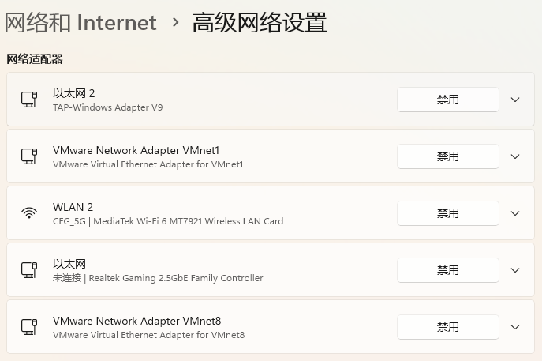
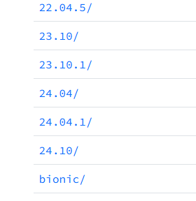

# 环境准备

建议购买一台云服务器，腾讯云或者阿里云，用来部署自己的项目 非常方便。

+ [阿里云活动期间服务器购买](https://www.aliyun.com/minisite/goods?taskCode=shareNew2205&recordId=3641992&userCode=roof0wob)
+ [腾讯云活动期间服务器购买](https://curl.qcloud.com/EiaMXllu)
+ [华为云活动期间服务器购买](https://www.huaweicloud.com/product/flexus.html)（这里我直接推荐我用的Flexus，有云服务器也可以更好的帮助你为后面的性能测试铺垫）

如果不用云服务器，就自己安装虚拟机 （很麻烦，不推荐）： 

我这里使用的是正常的win10及以上的系统

**下载好Vmware16：**

可以参考下面这篇文章

[最新版虚拟机VMware16pro下载与安装教程（保姆级）_vm ware 16 pro 下载-CSDN博客](https://blog.csdn.net/ie30GGG/article/details/124902981)

如果出现了虚拟机器也就是Ubuntu没有网络连接不上网的情况。

考虑以下几种情况：

检查你是否存在虚拟网卡

如果不存在可以考虑修复注册表因为这种情况大多数都是你删除vmwar的时候没删除干净，我推荐一个修复软件。

[Glary Utilities | Glarysoft](https://www.glarysoft.com/)

其他基本可以看这个解决(最重要一点一定要看你的ubuntu的网络和你的电脑是不是一个子网比如10.0.1.0最后一个0无所谓前面要一致)。

[Ubuntu无网络连接/无网络标识解决方法_ubuntu没网-CSDN博客](https://blog.csdn.net/qq_45400167/article/details/125874887)

Ubuntu24.04。

下载地址：  
[VMware虚拟机安装Ubuntu24.04教程（中文）_ubuntu24.04下载-CSDN博客](https://blog.csdn.net/qq_44490498/article/details/138261865)

# 补充
如果有的小伙伴不喜欢用ubuntu的操作方式这里可以使用vscode连接到ubuntu。

vscode的安装：

[VSCode安装配置使用教程（最新版超详细保姆级含插件）一文就够了_vscode使用教程-CSDN博客](https://blog.csdn.net/msdcp/article/details/127033151)

连接的话具体可以看下面的link：

[Vscode连接Ubuntu！看这一篇就够了！_vscode ubuntu-CSDN博客](https://blog.csdn.net/ggw15938357681/article/details/137228620)

> 更新: 2025-02-13 19:14:33  
> 原文: <https://www.yuque.com/chengxuyuancarl/knqvu3/ulesmtwmtzpyvm1g>